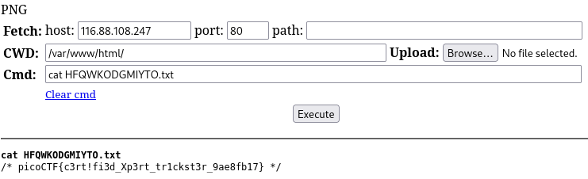

# Web Exploitation - Trickster

Flag: picoCTF{c3rt!fi3d_Xp3rt_tr1ckst3r_9ae8fb17}

## Write up

This is the challenge:

Accessing the webpage, this is what we see

I ran `gobuster` to see for any additional web pages that I can access.

If we access robots.txt, we see that we can access another webpage `instructions.txt`

These are the contents of that webpage

With these information, I decided to this 

I added the word PNG into the top of the file to ensure the first few bytes of the file is PNG

I then renamed the file to have the .png extension

Uploading the file shows that it passed

Now we access our uploaded file through `/uploads/`

After looking around using our webshell, we find the flag

And that's the challenge solved!